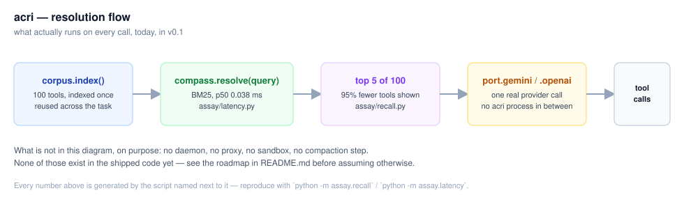
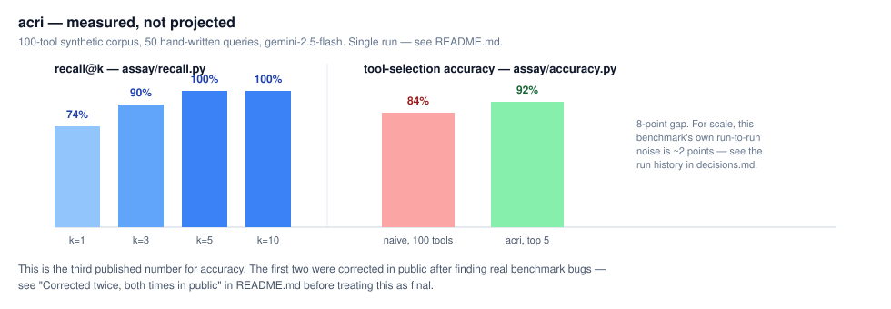

# acri

**A**gent **C**apability **R**esolution **I**nterface

> DNS resolves a name to an address.
> **acri resolves an intent to the right tools.**

You don't hand a browser all 300 million domains. You shouldn't hand a model all 300 tools.

---

## The problem

Tool selection degrades as your toolset grows. Anthropic's own documentation puts the
cliff at **30–50 tools**: past that, the model starts picking the wrong one.

The fix is to stop sending every schema on every request, and send only the few that
matter for the current turn. Anthropic ships this as
[tool search](https://docs.claude.com/en/docs/agents-and-tools/tool-use/tool-search-tool).
OpenAI ships an equivalent.

**Gemini does not. Ollama does not. vLLM does not. Your 8B local model does not.**

acri is that layer, for everyone else — one import, no gateway, no daemon, no framework
to adopt.

## What acri is

A client-side, provider-agnostic capability resolver. It sits between your code and the
LLM API, and decides which tools the model gets to see this turn.

## What acri is not

- **Not an MCP replacement.** MCP defines how tools connect. acri decides which of them
  the model sees. Your existing MCP servers work unchanged.
- **Not a framework.** No orchestration, no graph, no agent loop. It is a function you
  call. Use it inside LangGraph, inside the raw SDK, or inside nothing.
- **Not a proxy or gateway.** No process to run, no port to open, no network hop added.
- **Not a model.** Bring your own key. acri never calls an LLM you didn't ask for.

## What you can build with acri

acri doesn't ship a Blender integration, a Stripe integration, or any of the tools below —
it never generates content or executes anything. What it does is stay out of the way once
your own tool catalog gets large, on whatever you connect it to. Four hypothetical shapes,
illustrative rather than measured (none of these specific scenarios has an `assay/` run —
only the corpus-size-vs-recall numbers earlier in this README do):

1. **A creative pipeline** — Blender scripting, a design-tool REST API, image generation,
   video processing as MCP servers. A request like "render this scene and export a clip"
   only needs the handful of tools relevant to *that* request out of everything connected.
2. **DevOps/SRE tooling** — cloud infra, cluster, database, and alerting tools all
   registered at once. An incoming alert resolves against a few diagnostic tools, not
   the full catalog including destructive ones the model was never asked for.
3. **A multi-phase research pipeline** — this one *is* real and verified: resolve+call a
   fast/multimodal model for research, compress the result with `acri.press()`, resolve+call
   a stronger model for the write-up. Two independent `acri.run()` calls, your code decides
   the handoff — acri never switches providers mid-task itself. Full worked example:
   [`docs/cookbook.md`](docs/cookbook.md).
4. **Business-system tooling** — CRM, billing, ticketing APIs registered together. A billing
   query resolves against billing tools specifically, not the full connected surface.

The one number here that *is* measured and receipted: providers price a cached prompt
prefix at roughly a tenth of the uncached rate — confirmed directly against
[Anthropic's own pricing page](https://platform.claude.com/docs/en/build-with-claude/prompt-caching)
("cache read tokens are 0.1× the base input tokens price") — which is why acri resolves
once per task and only appends after, never rewrites (§3.2 in the paper has the full
argument, `docs/decisions.md` has the arithmetic).

## The system

```
acri
├── corpus    the capability index — MCP servers, OpenAPI, plain functions,
│             indexed into one searchable body
├── compass   the resolver — intent in, the right k tools out           ← the core
├── router    the tier picker — cheap/strong model, chosen once, before generating
├── port      provider adapters — see "Supported providers" below
├── config    acri.yaml — declares capabilities and limits, never control flow
├── daemon    the OpenAI-shaped request handler — acri.run(), nothing more
├── server    `acri up` — binds it: stdlib http.server, SSE, localhost by default
├── gate      the necessity check — does this turn need a tool at all?  (advisory)
├── press     the compactor — big payloads to short digests + a handle
├── sandbox   CPU/memory/network/volume limits on stdio MCP servers, via docker
├── ledger    the decision trace — what was chosen, skipped, and what it cost
├── studio    `acri studio` — read-only dashboard over acri.yaml + the ledger, own process/port
└── assay     the proving ground — the only place a benchmark number may come from

examples/     end-to-end scripts against a real MCP server — not part of the installed package
rust/         minimal Rust port of corpus + compass, v0.1 scope only — cargo add acri-core
typescript/   minimal TypeScript port of corpus + compass, v0.1 scope only — npm install acri-core
```

Both published ahead of their own stated gate in `docs/decisions.md` — see each directory's
own README for that reasoning stated plainly, not glossed over. Same v0.1 scope either way:
`corpus`/`compass` only, nothing else ported.

### Supported providers

acri is provider-agnostic by design — no model is "native" or first-class. Point it at
any LLM: name the provider, drop in its API key (or nothing, for a local server), and
acri connects. `models: default: provider/model` names the provider explicitly (the rest
is the literal model id, unaffected even if that id itself has a slash, e.g. OpenRouter's
`vendor/model` form). A bare model name with no `/` still resolves for gemini/openai
specifically — pre-existing configs from before this table existed keep working unchanged
— but writing the explicit `provider/model` form works identically for every provider,
gemini and openai included, and is the form every example below uses on purpose. One
provider per `acri up` process.

| Provider | acri.yaml | Needs |
|---|---|---|
| Anthropic (direct) | `default: anthropic/claude-sonnet-5` | `ANTHROPIC_API_KEY` |
| AWS Bedrock | `default: bedrock/anthropic.claude-sonnet-5` | `AWS_ACCESS_KEY_ID`, `AWS_SECRET_ACCESS_KEY`, `AWS_DEFAULT_REGION` (boto3's own chain) |
| Cloudflare Workers AI | `default: cloudflare/@cf/meta/llama-3.3-70b-instruct` | `CLOUDFLARE_ACCOUNT_ID`, `CLOUDFLARE_API_TOKEN` |
| Gemini (Developer API) | `default: gemini/gemini-2.5-flash` | `GEMINI_API_KEY` |
| Google Vertex AI | `default: vertex/gemini-2.5-flash` | `GOOGLE_APPLICATION_CREDENTIALS`, `GOOGLE_CLOUD_PROJECT` |
| Grok (xAI) | `default: grok/grok-4.6` | `XAI_API_KEY` |
| NVIDIA NIM | `default: nvidia/meta/llama-3.3-70b-instruct` | `NVIDIA_API_KEY` |
| Ollama (local) | `default: ollama/qwen2.5-coder:32b` | nothing — `OLLAMA_BASE_URL` optional, defaults to `localhost:11434` |
| OpenAI | `default: openai/gpt-5.6-luna` | `OPENAI_API_KEY` |
| OpenRouter | `default: openrouter/meta-llama/llama-3.3-70b-instruct` | `OPENROUTER_API_KEY` |
| vLLM (local) | `default: vllm/your-model` | nothing — `VLLM_BASE_URL` optional, defaults to `localhost:8000` |
| LM Studio (local) | `default: lmstudio/your-model` | nothing — `LMSTUDIO_BASE_URL` optional, defaults to `localhost:1234` |

Cloudflare/OpenRouter/NVIDIA/Grok/Ollama/vLLM/LM Studio all speak OpenAI's wire format,
so they reuse `port.openai_compatible()` unchanged — only the endpoint and which env var
holds the key differ ([`acri/_client_factory.py`](acri/_client_factory.py)). `acri check`
names exactly which of the above is missing before `acri up` ever tries to connect.

## Status

**Pre-alpha — API not yet stable (v0.x, see `docs/decisions.md`). `corpus` + `compass` +
`port` + `ledger` + `assay` + an exact-match cache + a pre-generation router all exist,
are tested, and back every claim below with a script or a test file. `daemon` (`acri up`)
exists too, ahead of its own gate — see the v1.0 roadmap row for what that means.**

```bash
pip install pyacri
```

Distribution name is `pyacri`, not `acri` — PyPI blocks names within edit-distance-1 of an existing
package (`acris`, `acr`, and `acre` already exist, all unrelated). `import acri` and the `acri` command
are unaffected, since PyPI's distribution name and the Python import name are separate settings.
Published via [`.github/workflows/publish.yml`](.github/workflows/publish.yml) (OIDC trusted publishing,
triggered by the `v0.4.0` GitHub Release). To install extras or work on acri itself, clone and:

```bash
pip install -e ".[dev]"
```

```python
import acri

tools = acri.from_callables([get_weather, get_stock_price, merge_pull_request])
corpus = acri.index(tools)          # build once, reuse across the whole task

result = acri.run("what's the weather in Tokyo?", corpus, my_openai_client)
print(result.tool_calls)            # [{"name": "get_weather", "arguments": '{"city": "Tokyo"}'}]
```

**Using an AI coding agent to add this to an existing project?** Copy
[`skills/acri-setup/SKILL.md`](skills/acri-setup/SKILL.md) into that project's
`.claude/skills/acri-setup/SKILL.md` (Claude Code) — it installs the right extras, picks
a provider without assuming one, writes a working `acri.yaml`, and wires `acri.run()`
into the existing call site. A skill, not an MCP server: acri is a library integrated
once at setup time, not a live tool an agent calls turn over turn — there's nothing for
an MCP server to expose here that the two-line integration in step 6 doesn't already do
more directly.

`acri.run()` resolves, calls the provider, and — if you pass `ledger=acri.Ledger()` — records
the trace. Prefer to drive the pieces yourself? `acri.resolve(query, corpus, k=5)` returns the
ranked tools; `acri.gemini` / `acri.openai_compatible` take it from there.

**Image or audio alongside the query?** `acri.run()`'s `query` always stays plain text —
that's what resolves tools — but an optional `prompt=` sends whatever you actually want the
model to see: `acri.run(query, corpus, client, prompt=[{"type": "text", "text": query}, {"type": "image_url", "image_url": {"url": data_uri}}])`.
Build the content list in whichever shape your provider expects (OpenAI/Anthropic/Gemini/Bedrock
each differ slightly) — acri passes it through unchanged, the same reason it never imports a
provider SDK to encode media itself. A multimodal `prompt` skips the cache automatically: two
different images behind the same query text must never collide on one cache key.

Read [`docs/architecture.md`](docs/architecture.md) for the full design, the prior art it
builds on, and the claims it explicitly refuses to make. Read
[`docs/decisions.md`](docs/decisions.md) for every capability that was proposed and cut,
with the evidence that decided it.

### First numbers

Measured on a synthetic 100-tool corpus spanning 20 domains (github, postgres, stripe,
aws_ec2, jira, zendesk, ...) with realistic cross-domain confusability, and 50 hand-written
queries phrased the way someone would actually type them, not as paraphrases of the tool
descriptions. Reproduce: `pip install -e ".[dev]"` then `python -m assay.recall`. Fixtures
and script: [`assay/fixtures.json`](assay/fixtures.json), [`assay/recall.py`](assay/recall.py).

| k | recall@k | tools shown instead of 100 |
|---|----------|-----------------------------|
| 1 | 74% — [`assay/recall.py`](assay/recall.py) | 1 |
| 3 | 90% — [`assay/recall.py`](assay/recall.py) | 3 |
| 5 | 100% — [`assay/recall.py`](assay/recall.py) | 5 |
| 10 | 100% — [`assay/recall.py`](assay/recall.py) | 10 |

Both adversarial queries (no correct tool exists in the corpus) correctly resolve to
nothing, at every k. The k=5 row moved from 86% to 100% ([`assay/recall.py`](assay/recall.py))
after a small query-side synonym table was added to `compass.py` —
[`_ALIASES`](acri/compass.py), 10 entries, each traced to
a real miss, not guessed (`pr` → `pull`, `request`; `rain` → `weather`; `text` → `sms`,
`message`; and so on). It expands the query only, never the indexed tool text, so a tool's
own description can't start quietly matching a synonym it never claimed.

Recall says the right tool is *available* to the model in a much smaller set — not that
the model picks it. That's a separate, live-model question:
[`assay/accuracy.py`](assay/accuracy.py), naive (all 100 tools) vs. acri (top 5), same 50
queries, real `gemini-2.5-flash` calls, no mocking.

**Corrected twice, both times in public.** The first published number here claimed acri roughly doubles accuracy: naive ~24%, acri ~53% (commit history on [`assay/accuracy.py`](assay/accuracy.py)). That was a broken benchmark: every one
of the 100 fixture tools had an *empty* parameter schema, so a well-behaved model correctly
declined to fabricate a ticket ID or a SQL string it was never given, and that correct
caution was scored as a tool-selection failure. Fixing the schemas and the obviously
under-specified queries produced a second number: naive 72%, acri 74% ([`assay/accuracy.py`](assay/accuracy.py)), that this README called modest and honest. It
was honest, but still not fully clean: a live diagnostic pass
(`assay/diagnose.py`) surfaced 9 more queries that satisfied their tool's *declared*
`required` fields but still left a genuinely necessary value unstated — "bump it up a size"
with no target size, "point \[domain\] at the new server" with no address, an opportunity
referenced by company name instead of ID. Full list and reasoning:
[`docs/decisions.md`](docs/decisions.md). Fixed the same way as the first round — supply the
missing value, or mark the field `required` if the action is meaningless without it — never
by rewording toward the answer. Third run, current:

| Arm | accuracy | median latency |
|---|---|---|
| naive (100 tools) | 84% — [`assay/accuracy.py`](assay/accuracy.py) | 1792 ms |
| acri (top 5) | 92% — [`assay/accuracy.py`](assay/accuracy.py) | 1596 ms |

**An 8-point gap this time, not noise** — for scale, naive's own score moved 2 points
between the previous two runs with zero code changes on its side, so 2 points is this
benchmark's rough noise floor at n=50; 8 is well outside it. `assay/diagnose.py` confirms
`resolver_miss=0` — every remaining acri miss is the model's, not compass's — and all four
share one shape: the model declines to act (`picked: None`, not a wrong tool) on a
write/mutating request — refund a charge, launch a server, send an email, book a meeting —
even once every *required* field is present. That reads as the model being conservative
about consequential actions specifically, not a resolver or benchmark defect, and it is left
unpatched on purpose: supplying more certainty than a real caller would have crosses from
fixing the benchmark into fixing the test until it passes. This is still a single run at each
stage; repeat runs would firm up the interval and are a natural next step, not yet taken.
Reproduce: `GEMINI_API_KEY=... python -m assay.accuracy --provider gemini`, or via
[Vertex AI / ADC](assay/clients.py):
`GOOGLE_APPLICATION_CREDENTIALS=... GOOGLE_CLOUD_PROJECT=... python -m assay.accuracy --provider vertex`.

What this means for the project's claims: **recall — the context-window reduction — remains
the number that survived every round unaffected** (BM25 never reads a tool's parameters, so
none of the query-completeness fixes could have moved it; only the synonym layer did, on
purpose). The accuracy claim is now both real and no longer small, but it took three
corrected rounds to get a benchmark that measures tool selection instead of measuring
whether the fixtures gave the model enough to work with — a fact worth remembering before
trusting the next number this project publishes, including from this project's own authors.

**Also verified against a real MCP server, not a mock:**
[`assay/mcp_live.py`](assay/mcp_live.py) spawns the official
`@modelcontextprotocol/server-filesystem` over stdio, ingests its live `tools/list` response
through `acri.adapters.from_mcp_tools()`, resolves a query against the real 14-tool corpus,
and executes the top-ranked tool through an actual `tools/call`. `list_directory` was the
top match for "what files are in this directory" (score 1.000 of 14 candidates), and its
live result contained a marker file planted before the run specifically to prove the pipeline
is real. Run: `python -m assay.mcp_live <a-directory> "<query>"` (needs Node.js on `PATH`).

`compass.resolve()` itself, over 1,040 calls against the same 100-tool corpus: p50 0.040ms,
p95 0.087ms ([`assay/latency.py`](assay/latency.py)). Not headlined on purpose — see
[`docs/decisions.md`](docs/decisions.md) for why resolver latency is beside the point
against a network call measured in hundreds of milliseconds.

### Does it hold up at scale?

[`assay/scale.py`](assay/scale.py) reruns recall@k and latency against
[`assay/fixtures_500.json`](assay/fixtures_500.json) — the same 100 tools and 52 gold queries
above, plus ~400 more tools across ~40 new domains (gitlab and bitbucket alongside github,
discord and telegram alongside slack, and so on), so corpus size is the only thing that
changed. It isn't: recall@5 drops from 100% to 92%, recall@1 from 74% to 60% — [`assay/scale.py`](assay/scale.py).
Latency stays fast — p50 0.179ms, p95 0.285ms at 504 tools, still nothing against a network
call. The context-window case gets stronger, not weaker, at this scale: 5 of 504 tools shown is a 99% reduction — [`assay/scale.py`](assay/scale.py), the same
arithmetic the 100-tool table above already uses. Recall genuinely degrades, though, and
that's the metric that matters more than either latency or the reduction percentage.

The honest reason, checked query by query rather than assumed: BM25 has no semantic
understanding, so once a real lexical competitor exists it can win. "Is PR 42 on the
acme/webapp repo merged" now out-scores `github_get_pull_request` with `bitbucket`'s own
pull-request tools, because neither tool's description names its own platform and the query
doesn't say which host it means — a gap the original 100-tool corpus never had to close, since
no second git host existed to be confused with. Not patched: rewording the query toward the
answer or adding an alias here would be tuning the benchmark, not fixing the resolver — see
`docs/decisions.md`'s "Corrected twice, both times in public" for why that line gets held.
Reproduce: `python -m assay.scale`.

### Diagrams





Both are static SVGs generated from the numbers above, nothing more — no simulator, no live
trace, no feature these diagrams show that isn't already shipped and linked to the script
that measured it. If a future version adds `studio` (the real trace visualizer — see
[`docs/decisions.md`](docs/decisions.md)), it replaces these; until then, these are it.

### Roadmap

| Version | Scope | Gate to ship |
|---------|-------|--------------|
| **v0.1** | `corpus` + `compass` + `port` + minimal `ledger` | **Shipped.** `pytest` green, no native deps. |
| **v0.2** | `assay` | **Shipped.** Recall, latency, and a live accuracy result, all above — the accuracy number was corrected twice after the benchmark itself was found to be flawed, both times in public. |
| **v0.3** | Pre-generation router, exact-match cache | **Shipped.** Cache: `acri.run(..., cache={})` skips a repeated (provider, model, query, offered tools) call — [`acri/port.py`](acri/port.py)'s `cached_call`. Router: `acri.run(..., cheap_model=...)` routes one call to a cheaper tier, once, before generating — [`acri/router.py`](acri/router.py). Eligibility (is this call stateless and prefix-free?) is the caller's judgment, not acri's — see `docs/architecture.md` §4.4. Tests: [`tests/test_ports.py`](tests/test_ports.py), [`tests/test_router.py`](tests/test_router.py), [`tests/test_integration.py`](tests/test_integration.py). |
| **later** | `gate`, `press` | **Shipped, ahead of their gate** ("only if `ledger` data proves they are needed" — no real ledger data exists yet; built at the maintainer's explicit request, same override pattern as the daemon). `gate` ([`acri/gate.py`](acri/gate.py)): a threshold on the raw BM25 score `compass` already computes — `Resolved.score` is always 1.0 for the winner by construction, so `raw_top_score()` exposes the un-normalized number instead. No default threshold ships; picking one needs the same ledger data the gate condition itself was waiting for, so it stays caller-supplied. `press` ([`acri/press.py`](acri/press.py)): large tool results become a digest plus a handle to the untruncated original — `recover()` gets it back, which is the answer to the "digest drops an identifier" risk `docs/architecture.md` names. TOON-style header-once encoding for uniform tabular results; not the `toon-format` PyPI package, whose `encode()` raises `NotImplementedError` as of 0.1.0 — checked directly before writing this instead. Tests: [`tests/test_gate.py`](tests/test_gate.py), [`tests/test_press.py`](tests/test_press.py). |
| **v1.1** | `sandbox` — CPU/memory/network/volume limits on stdio MCP servers; `find_more_tools`, the escape hatch `docs/architecture.md` §4.1 always documented | **Shipped.** [`acri/sandbox.py`](acri/sandbox.py) wraps an `mcp:` entry's command in `docker run -i --rm` with resource limits and, via `acri.yaml`'s `sandbox.volumes:` (host path → container path), `-v` mounts — so a sandboxed filesystem/git server can see a real project folder; append `:ro` to a container path yourself for read-only, no separate flag. Calls the container engine, never reimplements namespaces/cgroups, per `docs/decisions.md`. Docker Desktop's daemon wasn't running in the environment this was built in, so the command-construction is tested ([`tests/test_sandbox.py`](tests/test_sandbox.py)) but an actual `docker run` proxying a real MCP session is not — stated plainly, not glossed over. `find_more_tools` ([`acri/escape_hatch.py`](acri/escape_hatch.py)): `acri.run()` always appends it to the tools actually sent to the provider — not to `compass.resolve()`'s own output, so the recall@k numbers above are unaffected, and not to the ledger's `offered`, which stays the real resolution candidates only ([`tests/test_integration.py`](tests/test_integration.py)). Calling it re-searches the full corpus; the caller executes it and appends the result like any other tool call, per §4.1's "append, never rewrite" rule — acri does not auto-execute it. Tests: [`tests/test_sandbox.py`](tests/test_sandbox.py), [`tests/test_config.py`](tests/test_config.py), [`tests/test_escape_hatch.py`](tests/test_escape_hatch.py). Live, end-to-end demo against a real MCP server: [`examples/live_demo.py`](examples/live_demo.py). |
| **v1.0** | `daemon` — long-lived process, OpenAI-compatible HTTP endpoint | **Shipped, ahead of its own gate.** `docs/decisions.md`: "the daemon is built after the library has users who want it, not before" — not met (no PyPI release yet), and built anyway at the maintainer's explicit request; that override is deliberate, not an oversight. `acri up` ([`acri/server.py`](acri/server.py), stdlib `http.server` only) connects to `acri.yaml`'s `mcp:` entries once at startup ([`acri/mcp_connect.py`](acri/mcp_connect.py)), then serves `/v1/chat/completions` over SSE via [`acri/daemon.py`](acri/daemon.py)'s handler — the same `acri.run()` the library calls, not a reimplementation. Binds `127.0.0.1` by default; conversation content is opt-in (`--log-conversations`), off by default via `RedactingLedger`. Verified against a real MCP server and a real Gemini call, not just fakes — which surfaced and fixed a real bug: Gemini's function-calling schema rejects the `$schema` key real MCP servers commonly add, invisible to every synthetic fixture in this repo (`acri/schemas.py`). Tests: [`tests/test_config.py`](tests/test_config.py), [`tests/test_cli.py`](tests/test_cli.py), [`tests/test_daemon.py`](tests/test_daemon.py), [`tests/test_server.py`](tests/test_server.py), [`tests/test_schemas.py`](tests/test_schemas.py). Wire-level SSE only — one blocking `acri.run()` call chunked out, not a true streaming upstream call. |
| **v1.2** | `studio`, minimal Rust and TypeScript ports, PyPI publish workflow | **Shipped, ahead of gate, each stated plainly.** `studio` ([`acri/studio.py`](acri/studio.py)): decisions.md already had a full design for this (`docs/decisions.md`, "`studio` — the trace visualizer") — built to that spec, not invented from scratch; two honest simplifications against it recorded in [`docs/architecture.md`](docs/architecture.md) §4.5. Own process, own port (`acri studio`, default 8099), reads only `acri.yaml` and `.acri/ledger.jsonl`, never connects to an MCP server or a model — a separate `pip install pyacri[studio]` extra, per decisions.md's own naming (PyPI's distribution name; `import acri` and the `acri` command are unaffected). Two views: the static mesh (servers/models/tools ever seen) and the live trace (recent ledger entries, polled every 2s). `rust/` and `typescript/`: v0.1-scope-only ports of `corpus` + `compass` (BM25 resolve()) — nothing else. Rust's gate ("only if `assay` shows Python ranking is a measurable share of a turn") has been measured and answered no (`assay/scale.py`: p50 0.179ms against network calls running hundreds of ms+); TypeScript's gate ("after the Python package has users, never in parallel") is unmet on its own terms, no PyPI release exists yet. Both verified against `tests/test_compass.py`'s exact cases: Rust 9/9 (`cargo test`), TypeScript 5/5 (`npm test`). [`.github/workflows/publish.yml`](.github/workflows/publish.yml): OIDC trusted publishing, triggered only by a published GitHub Release, not a tag push — needs a one-time trusted-publisher registration on PyPI's side before it can run at all. Tests: [`tests/test_studio.py`](tests/test_studio.py), [`tests/test_studio_data.py`](tests/test_studio_data.py). |

## The claims policy

This project makes no performance claim it cannot reproduce.

No number appears in this repository — README, docs, paper, or commit message — unless a
script in `assay/` regenerates it from a public benchmark, and the run is committed
alongside it. Estimates are labelled as estimates. Projections are labelled as
projections.

If you find a number here without its receipt, that is a bug. Please
[open an issue](../../issues/new).

## Prior art

acri stands on published work and does not pretend otherwise:

- [RAG-MCP](https://arxiv.org/abs/2505.03275) — retrieval over tool schemas to cut prompt bloat
- [When2Call](https://arxiv.org/abs/2504.18851) — when (not) to call tools
- [Anthropic tool search](https://docs.claude.com/en/docs/agents-and-tools/tool-use/tool-search-tool) and [context editing](https://docs.claude.com/en/docs/build-with-claude/context-editing) — the same idea, shipped provider-side

acri's contribution is **placement**: the same capability, client-side and
provider-agnostic, for the models that don't have it natively.

## License

MIT — see [LICENSE](LICENSE).

Built by [Piyush Sharma](https://github.com/ScienHAC) under [INERATE](https://github.com/INERATE),
alongside [Atelier](https://github.com/INERATE/atelier).
